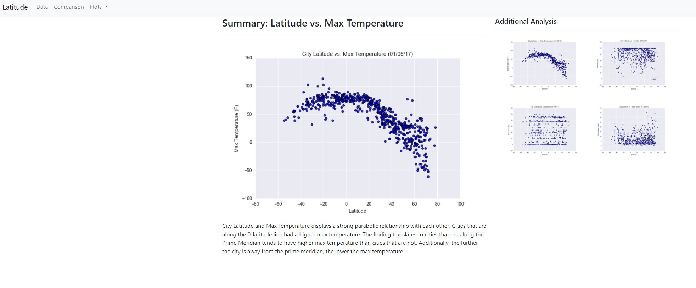

# Web-Design-Challenge
For this challenge, I will be using [weather](Resources/cities.csv) and its visualizalizations to build a web page.
I will be demonstrating my familiarity with bootstrap and UX. The side panel includes highlighting the graph the user is selecting for clarity.
The dataset is also present as a tab for users to examine.

https://kenjyeh.github.io/web-design-challenge/
